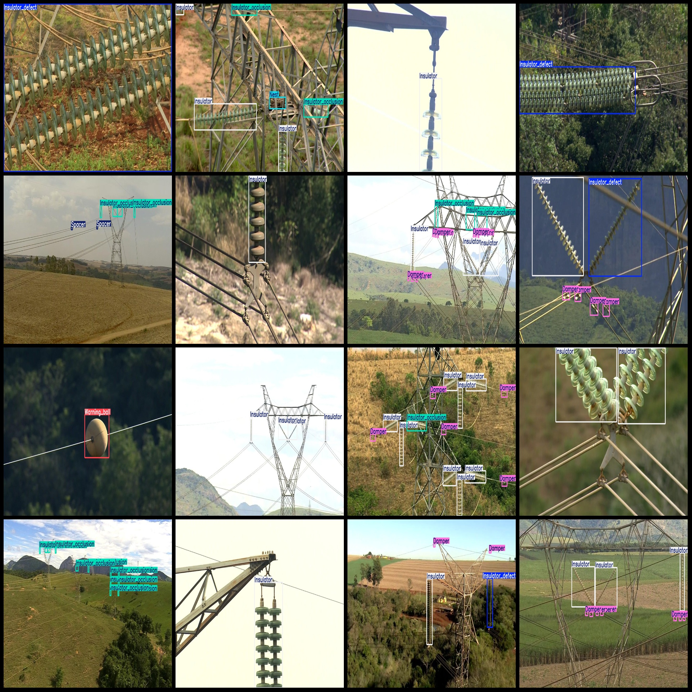
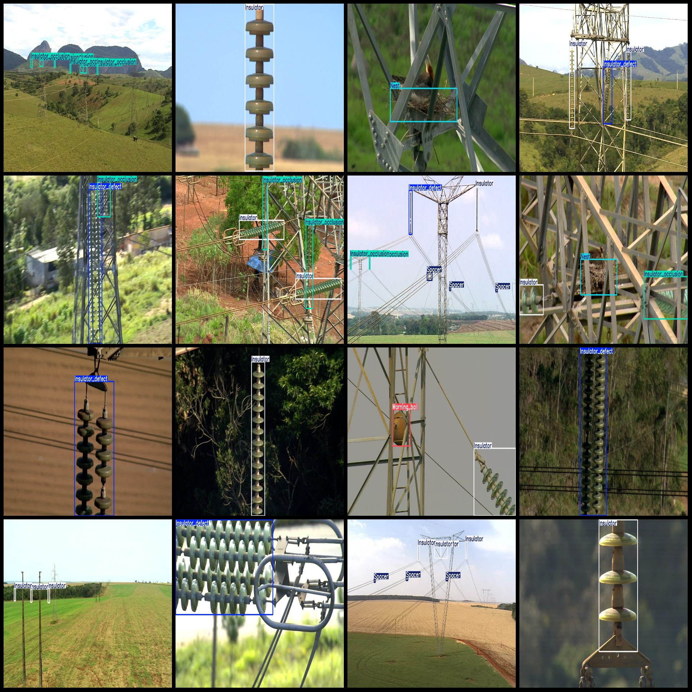

# Power Scene Electrical Fault Detection Dataset (VOC+YOLO format, 5714 categories)

Dataset format: Pascal VOC format + YOLO format (txt file without split path, only containing jpg images and corresponding VOC format xml files and yolo format txt files)
Number of images (jpg file count): 5714
Number of annotations (xml file count): 5714
Number of annotations (txt file count): 5714
Number of annotation categories: 8
Annotation category names (note that the order in the yolo format categories does not correspond to this, but is based on the labels folder's classes.txt): ["Damper", "Insulator", "Insulator_defect", "Insulator_occlusion", "Nest", "Spacer", "Warning_ball", "Warning_ball_defect"]
Number of bounding boxes for each category:
Damper = 2804
Insulator = 7875
Insulator_defect = 1902
Insulator_occlusion = 1618
Nest = 330
Spacer = 1027
Warning_ball = 491
Warning_ball_defect = 190
Total bounding boxes: 16237
Image resolution: 1280x720
Annotation tools used: labelImg
Annotation rules: draw rectangle boxes for categories
Important note: No specific statements are made here
Special declaration: This dataset does not guarantee any accuracy in the training models or weights files
Image preview:
## Images

Here is a pay link on Stripe ( https://buy.stripe.com/3cs8yP7sY87d0vu9AB ). Please contact me lonlonago@foxmail.com after funding $89, and I will send you a complete data files , thank you!

